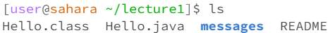
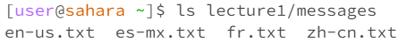
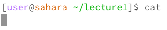
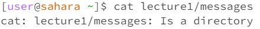
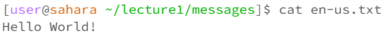

# Lab Report 1

## Command `cd`
**Command with no arguments**  
  
The working directory when the command was ran is /home/lecture1/messages.
After running the cd command with no arguments, nothing was printed, but the directory was changed to /home. This is the resulting output because running cd with no arguments will always set the directory to /home. 
The output was not an error.

**Command with a path to a directory**  
  
The working directory when the command was ran is /home. 
After running the cd command with the argument lecture1/messages, the directory was changed to /home/lecture1/messages. This is the resulting output because running cd with a path to a directory will set the directory to the working directory + the directory in the argument. 
The output was not an error.

**Command with a path to a file**  
  
The working directory when the command was ran is /home/lecture1.
After running the cd command with the argument Hello.java, an error message was printed stating that Hello.java is not a directory. This is the resulting output because the directory cannot be set to be inside a file, so trying to do so will result in an error. 

## Command `ls`
**Command with no arguments**  
  
The working directory when the comman was ran is /home/lecture1.
In this case, the working directory contained a folder called messages, and files called Hello.class, Hello.java, and README. After running the ls command with no arguments, a list of subitems in the working directory is printed. 
The output was not an error.

**Command with a path to a directory**  
  
The working directory when the comman was ran is /home.
After running the ls command with a directory, it prints a list of subitems in the provided directory starting from the current directory. Since lecture1/messages was the given argument, the command printed the list of subitems in /home/lecture1/messages.
The output was not an error.

**Command with a path to a file**  
  
The working directory when the comman was ran is /home/lecture1.
After running the ls command with a file, 

## Command `cat`
**Command with no arguments**  
  
The working directory when the comman was ran is

**Command with a path to a directory**  
  
The working directory when the comman was ran is

**Command with a path to a file**  
  
The working directory when the comman was ran is
