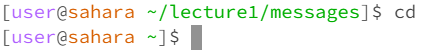
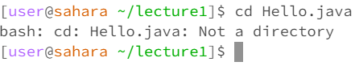

# Lab Report 1

## Command `cd`
**Command with no arguments**

**Command with a path to a directory**

**Command with a path to a file**

## Command `ls`
**Command with no arguments**
**Command with a path to a directory**
**Command with a path to a file**

## Command `cat`
**Command with no arguments**
**Command with a path to a directory**
**Command with a path to a file**
