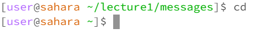
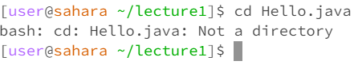
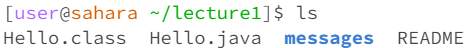
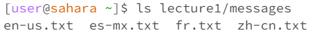
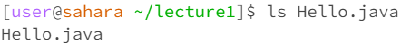
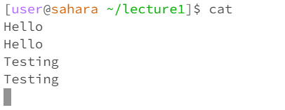
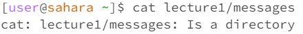
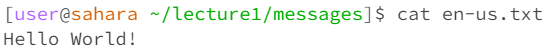

# Lab Report 1

## Command `cd`
**Command with no arguments**  
  
The working directory when the command was ran is /home/lecture1/messages.
After running the cd command with no arguments, nothing was printed, but the directory was changed to /home. This is the resulting output because running cd with no arguments will always set the directory to /home. 
The output was not an error.

**Command with a path to a directory**  
  
The working directory when the command was ran is /home. 
After running the cd command with the argument lecture1/messages, the directory was changed to /home/lecture1/messages. This is the resulting output because running cd with a path to a directory will set the directory to the working directory + the directory in the argument. 
The output was not an error.

**Command with a path to a file**  
  
The working directory when the command was ran is /home/lecture1.
After running the cd command with the argument Hello.java, an error message was printed stating that Hello.java is not a directory. This is the resulting output because the directory cannot be set to be inside a file, so trying to do so will result in an error. 

## Command `ls`
**Command with no arguments**  
  
The working directory when the command was ran is /home/lecture1.
In this case, the working directory contained a folder called messages, and files called Hello.class, Hello.java, and README. After running the ls command with no arguments, a list of items in the working directory is printed. 
The output was not an error.

**Command with a path to a directory**  
  
The working directory when the command was ran is /home.
After running the ls command with a directory, it prints a list of subitems in the provided directory starting from the current directory. Since lecture1/messages was the given argument, the command printed the list of subitems in /home/lecture1/messages.
The output was not an error.

**Command with a path to a file**  
  
The working directory when the command was ran is /home/lecture1.
After running the ls command with a file, it prints the argument that was entered. Since Hello.java was the argument given in this case, the command outputs Hello.java.
The output was not an error.

## Command `cat`
**Command with no arguments**  
  
The working directory when the command was ran is /home/lecture1.
After running the cat command with no arguments, nothing was immediately outputed. However, if something is then typed into the terminal, it gets printed out again as seen from the duplicate lines.
The resulting output was not an error.

**Command with a path to a directory**  
  
The working directory when the command was ran is /home.
After running the ls command with a directory, it prints an error message stating that the given argument is a directory. Since lecture1/messages does not lead to a file, cat cannot print the contents of it and thus the output is an error.

**Command with a path to a file**  
  
The working directory when the command was ran is /home/lecture1/messages.
The working directory contains a file called en-us.txt that contains "Hello World!". When the cat command is called on a file, it prints out the contents of that file. 
The output was not an error.
